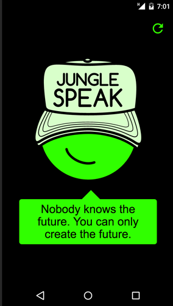
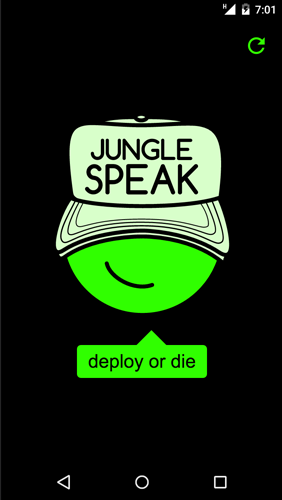

# Speak





♡ We speak therefore we are.

⎋ Speak up!

♨ A Volcano of vocabularising

✌ Haiku 俳句 short poetry

※ Graphic, Efficient, Rapid Communication Bricks

⁂ Use me to get a clue and to get the message through!

❊ Who? its a second click quest and pleasure!


## Speak website v.0.15.0 features

- Site content licensed under a [Creative Commons Attribution 4.0 International license.](https://creativecommons.org/licenses/by/4.0/)
- Conditional Media Query Mixin [by @sheiko](https://github.com/dsheiko)
- Speech-bubbles inspired by [Nicolas Gallagher]( http://nicolasgallagher.com/pure-css-speech-bubbles/)
- Compressed html [thanks to Anatol Broder](https://github.com/penibelst/jekyll-compress-html)
- Zero plugins
- Web app standalone functionality with chrome (android only :().
- Inlined svg icons
- 100% vanilla js
- Open graph metas
- Twitter cards
- auto generated OG/Twitter preview images using [gulp-webshot](https://www.npmjs.com/package/gulp-webshot),[node-webshot](https://github.com/brenden/node-webshot), which uses [PhantomJS](http://phantomjs.org/)
- Data driven navigation
- jekyll sitemap
- Page titles that make sense
- Understandable body tags sentences
- Selected keyword (categories) navigation
- random quote on home via js
- use `font: caption;` (no more webfont.js async) to leverage [operating system fonts](http://codepen.io/dope/pen/YyxKBj)
- SSL/HTTPS and hosting by [Netlify](https://www.netlify.com/)

## To do

**Sometime soon:**

- just keep master branch since gh-pages is not needed anymore
- travis-ci tests
- turn speechbubble css into svg
- share links (fb, g+, twitter) in single (page bottom)
- double kudos: love|hate
- smooth transitions
- service workers
- print.css

**Maybe:**

- contribute form (use [Netlify forms](https://www.netlify.com/docs/form-handling/) or [eduardoboucas](https://eduardoboucas.com/blog/2016/08/10/staticman.html) [staticman](https://staticman.net/))

## Setup

Default branch: gh-pages | Master branch: for development.

## Dev features

- gulp OG/twitter cards preview images generation (gulp-webshot using phantomjs)
- gulp browsersync

## Gems dependencies:

- github-pages
- jekyll-feed
- html-proofer
- jekyll-sitemap
- jekyll-seo-tag

## Prerequisites

Node, Npm, gulp

## Getting started

#### 0. If you haven't yet, install Bundler + Gulp globally!

```sh
gem install bundler
```

```sh
npm install --global gulp
```
## Dev time

#### 1. In project local dir:

```sh
bundle install
```

#### 2. Install Gulp in project local dir:

```sh
npm install --save-dev gulp
```

#### 3. First run Jekyll like this:

```sh
bundle exec jekyll serve --trace
```

#### 4. Open a new terminal window and run

(meta previews images for social networks, OG, Twitter, chats and the such...)

```sh
gulp make-previews
```
you might need to change which images are generated by adjusting line 20 of gulpfile.js

#### 5. (optional) Open a new terminal window and run browsersync via gulp:

```sh
gulp
```
