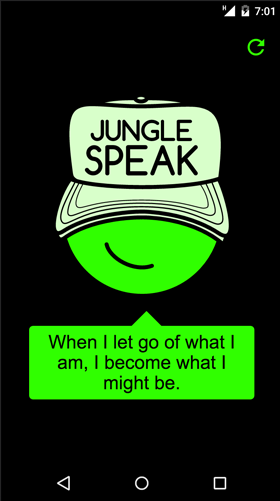
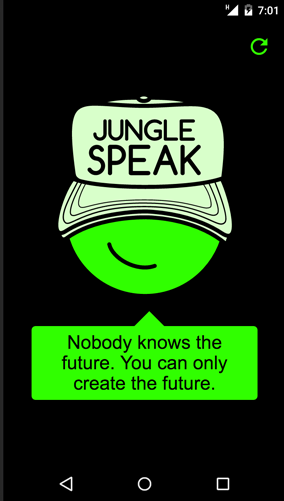

# Speak

[](https://app.netlify.com/sites/speak/deploys)

> ♨ A Volcano of Vocabularising
> ✌ Haiku 俳句 short poetry
> ※ Graphic, Efficient, Rapid Communication Bricks
> ⁂ Use me to get a clue and to get the message through!
> ♡ We speak therefore we are.

Live: **<https://speak.junglestar.org>**




---

## What it is

A collection of 593 short quotes, organised by mood: Kids, Advices, Singlish, Serious, Statements, Catchphrases, English, Geek, Italiano, Questions. Each quote is a single thought rendered in a green speech bubble.

## Stack

- **[Astro](https://astro.build) 6.3.1** (static site generation)
- **pnpm 11.1.1**, **Node 24.15.0**
- **Modern CSS only** — no preprocessor. snake_case classes, `@layer`, OKLCH brand colors, scoped per-component styles
- **TypeScript** for content schema + helpers (Zod via `astro/zod`)
- **Netlify** for build + hosting
- Migrated from Jekyll on 2026-05-13 (see [`CHANGELOG.md`](./CHANGELOG.md), pre-cutover Jekyll preserved at the `jekyll-final` tag).

## Quick start

```sh
# install deps (corepack will activate pnpm@11.1.1)
pnpm install

# dev server with auto-open
pnpm dev

# production build → dist/
pnpm build

# preview the production build
pnpm preview

# run the test pipeline (astro check + vitest + parity smoke)
pnpm test
```

## Repo layout

```
.
├── astro.config.mjs       # Astro 6 config
├── netlify.toml           # Netlify build command + headers
├── CHANGELOG.md           # Source of truth for versions
├── PLAN.md                # Original migration plan
├── public/                # Static assets served at site root
│   ├── assets/            # Favicons, twittercard, images
│   ├── robots.txt
│   └── *.png              # Quote images
├── src/
│   ├── content/posts/     # 593 markdown posts
│   ├── content.config.ts  # Zod schema + glob loader
│   ├── data/              # menu.json, categories.json
│   ├── icons/             # Per-icon .svg files (Astro components)
│   ├── lib/               # posts, categories, excerpt, date, site
│   ├── components/        # Header, Footer, Nav, PostCard, …
│   ├── layouts/           # BaseLayout, HomeLayout, PageLayout, PostLayout
│   ├── pages/             # index, [slug], 10 category pages, feed.xml
│   └── styles/            # tokens, reset, base, bodies, svg_colors, utilities, components
├── tests/                 # vitest + parity smoke
└── scripts/               # split-sprite.mjs (one-off migration tool)
```

## Scripts

| Command | What it does |
|---|---|
| `pnpm dev` | Astro dev server, opens in browser |
| `pnpm build` | Production build → `dist/` |
| `pnpm preview` | Serve the built `dist/` |
| `pnpm check` | `astro check` watch + dev server |
| `pnpm test` | `astro check && vitest run && node tests/parity.mjs` |
| `pnpm test:unit` | Vitest only |
| `pnpm test:parity` | Build-smoke check on `dist/` |
| `pnpm clean` | Remove `.astro`, `dist`, `node_modules/.vite` |

## Authoring a quote

Drop a markdown file in `src/content/posts/`:

```md
---
title: "pep talk"
categories: english serious kid
author: Kid President (9 year old)
goto: https://www.ted.com/talks/kid_president_i_think_we_all_need_a_pep_talk
go: watch
---
Pass this Pep talk Along!
```

Filename format: `YYYY-MM-DD-some-slug.md` — the date is parsed from the filename; the slug becomes the URL.

## Changelog

See [`CHANGELOG.md`](./CHANGELOG.md). Latest:

- **3.0.0** (2026-05-13) — Astro replaces Jekyll in production. `netlify.toml` added, repo hoisted to root.
- **2.1.0** (2026-05-13) — Zod cleanup, canonical SVG-as-component pattern, full visual parity pass.
- **2.0.0** (2026-05-12) — Initial Astro 6 port alongside Jekyll (mono-repo split).

## License

Site content & source under [Creative Commons Attribution 4.0 International](https://creativecommons.org/licenses/by/4.0/).

## Credits

- Speech-bubbles inspired by [Nicolas Gallagher](http://nicolasgallagher.com/pure-css-speech-bubbles/).
- Hosted on [Netlify](https://www.netlify.com/).
- Produced by [Jungle★star](http://junglestar.org).
